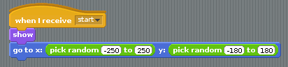
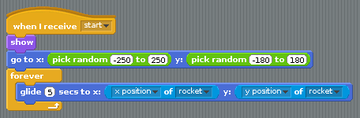
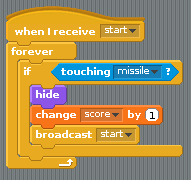
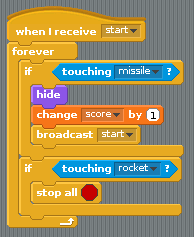

## Coding the UFO

- The UFO needs to start in a random location and then chase after the rocket. This is fairly easy to set up. The Scratch `stage` stretches from about -250 to 250 horizontally (the x-axis) and -180 to 180 vertically (the y-axis), so picking two random numbers in these ranges will enable you to position the rocket:

	

- Next, you can use a `forever` loop to get the UFO to chase the rocket:

	

- In a minute, you'll code the missile to launch at the UFO. If the missile hits the UFO, the game should restart and the player's score should go up by one. A new script is needed for this:

	

- To finish off the UFO, the game needs to end if it catches the rocket:

	

