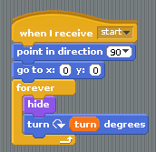
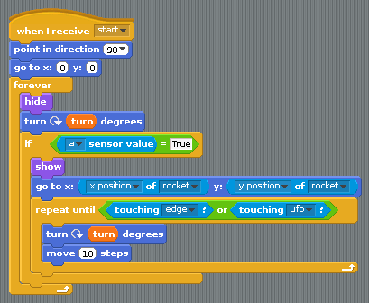

## Coding the missile

- To make the missile always point in the correct direction, you can make it turn exactly the same way as the rocket:

	

- Next, whenever the `a` button is pressed on the micro:bit, the missile should fire. To do this, you can move it to the location of the rocket, tell it to `show` and then move forwards until it hits either the UFO or the edge of the screen. It will need to carry on turning as it flies, otherwise the missile's rotation will become out of sync with the rocket.

	

- Test out your rocket's new ability to shoot missiles.

