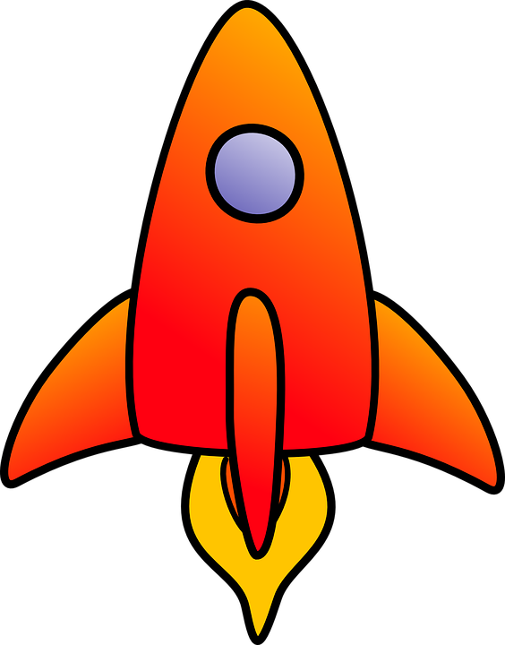
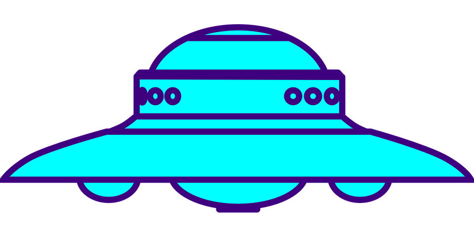
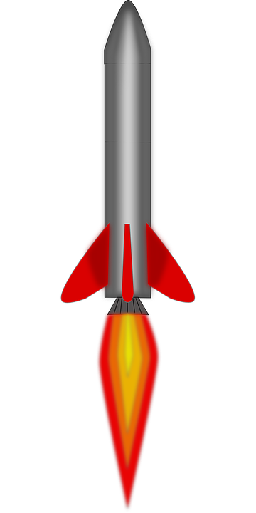
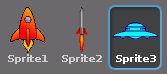
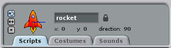
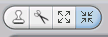
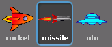
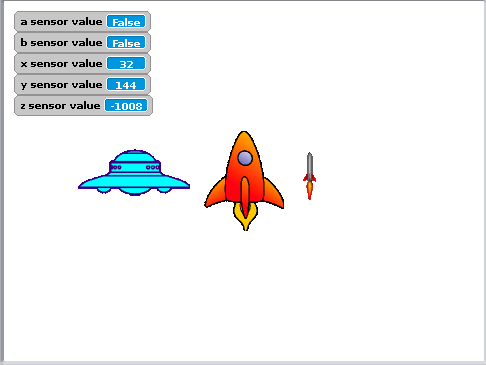

## Making the assets

You're going to need three new sprites for this game. Delete the cat sprite and then find a rocket sprite, a UFO sprite and a missile sprite. You can use the ones below if you like, search on the web, or even draw your own.

- Import each of your sprites into Scratch:

	

- Rename the sprites by changing the name in the **scripts** pane:

	

- The sprites will also need to be resized. You can use the `shrink sprite` tool to do this:

	

- Lastly, you should rotate the rocket and missile sprite, so they both point toward the right-hand side of the screen. You can do this by editing the sprite in the **costume** tab and choosing the `rotate` tool:

