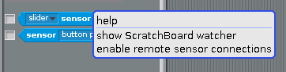
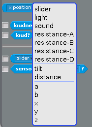
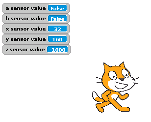

## Setting up Scratch

- Open Scratch on the Raspberry Pi (**Menu** > **Programming** > **Scratch**).

- Go to **Sensing**, then right-click on `slider sensor value` near the bottom of the screen and choose `enable remote sensor connections` from the context menu. Click on **OK** when the dialogue box opens.

	

- Now switch back over to IDLE and press **F5** to run your `rpi.py` script.

- In Scratch, you should now be able to view the values from the micro:bit's sensors. Simply click on the arrow on the **slider sensor value** block, choose `a` and then check the box:

	
	

- If you repeat this for sensors `b`, `x`, `y`, and `z`, then your Scratch stage should look something like this:

	

- If you tilt the micro:bit you should see the `x`, `y`, and `z` values changing. Pushing the buttons will switch `a` and `b` from `False` to `True`.

- If the readings aren't working, check the micro:bit port again, and make sure the code is running on both the micro:bit and the Raspberry Pi.

