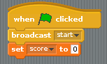
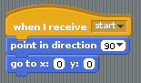
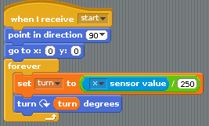
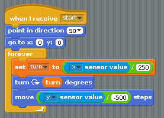

## Coding the rocket

- To code your game, you can start by adding some scripts to the rocket. Because you want the game to be able to be played over and over again, you should start it by using a `broadcast` block. You'll also need to make a variable called `score` and set it to `0` at the start of the game:

	

- To start the game, the rocket needs to be placed in the centre of the screen, pointing towards the right:

	

- Next, you need to control the rotation of the rocket. This is going to be decided by the accelerometer reading from the micro:bit, in particular from the `x` sensor value. At the moment, this is a value between about -1000 and 1000, so it needs to be reduced a little. Create a new variable called `turn` and set it as shown below:

	

- Test out your game so far: when you tilt the micro:bit left and right, the rocket should spin around. If it's not working, try restarting the Python 3 program on your Raspberry Pi and re-flashing the micro:bit with its program. You might also have to check that the micro:bit hasn't reconnected to a different port; you can check by using the command `ls /dev/ttyA*`.

- Next, you want the rocket to move. The speed can be determined by how far forwards or backwards the micro:bit has been tilted. You can use the `y` sensor value for this, but as before, you'll need to reduce the value a little (and in this case reverse it).

	

- Test your flight controls now by tilting the micro:bit left and right, forwards and backwards.

