# BBC micro:bit game controller

This is an archived resource. The repo will remain available but the resource will no longer be maintained or updated. Some or all parts of the resource may no longer work. To see our latest resources, please visit [raspberrypi.org](http://www.raspberrypi.org). 

In this resource, you'll use a micro:bit as a game controller in Scratch, and help regain control of the galaxy!

## Setting up the micro:bit

If you are unfamiliar with using the micro:bit, MicroPython, and the Raspberry Pi, you might want to take a look at the [Getting Started with the micro:bit](https://www.raspberrypi.org/learning/getting-started-with-microbits) resource.

## Finding the USB port

For the micro:bit to be able to communicate with Scratch, you need to know how the micro:bit is connected to the Raspberry Pi.

1. With the micro:bit **disconnected** from the Raspberry Pi, open up LXTerminal and type the following:

    ```bash
	ls /dev/ttyA*
    ```

1. Plug your micro:bit in via the USB cable and type the command again:

    ```bash
	ls /dev/ttyA*
    ```

1. There should be a new entry in the output, probably something like `dev/ttyACM1`. You need to note this down.

## Setting up the Python file

1. Open IDLE (**Menu** > **Programming** > **Python 3**), create a new file (**File** > **New File**), and copy and paste the code below into the file. Save it as `rpi.py`.

	```python
	import serial
	from time import sleep
	import scratch


    scr = scratch.Scratch()
    ## THE NEXT LINE MIGHT NEED TO BE CHANGED - TYPE ls /dev/ttyA* into the terminal to see which port is needed.
	PORT = "/dev/ttyACM1"
	##
	BAUD = 115200

	s = serial.Serial(PORT)
	s.baudrate = BAUD
	s.parity   = serial.PARITY_NONE
	s.databits = serial.EIGHTBITS
	s.stopbits = serial.STOPBITS_ONE

	while True:
		data = s.readline().decode('UTF-8')
		data_list = data.rstrip().split(' ')
		try:
		    x, y, z, a, b = data_list
			scr.sensorupdate({'x' : x})
			scr.sensorupdate({'y' : y})
			scr.sensorupdate({'z' : z})
			scr.sensorupdate({'a' : a})
			scr.sensorupdate({'b' : b})

		except:
			pass

	s.close()
	```

1. This file, once running, will listen to any data being sent out from the micro:bit, and send it over to Scratch. You may have to change this line:

	```python
	PORT = "/dev/ttyACM1"
	```

It needs to be the same as the port you noted down earlier.

## Coding the micro:bit

The micro:bit needs to run some code that will constantly print out its accelerometer readings and button pushes.

1. Open mu by opening LXTerminal and typing the following command:

	```bash
	./mu
	```

1. Now copy and paste the code below into the editor:

	```python
	from microbit import *

	def get_sensor_data():
		x, y, z = accelerometer.get_x(), accelerometer.get_y(), accelerometer.get_z()
		a, b = button_a.was_pressed(), button_b.was_pressed()
		print(x, y, z, a, b)


	while True:
		sleep(100)
		get_sensor_data()

	```

1. You can flash this file into your micro:bit straight away.

## Setting up Scratch

1. Open Scratch on the Raspberry Pi (**Menu** > **Programming** > **Scratch**).

1. Go to **Sensing**, then right-click on `slider sensor value` near the bottom of the screen and choose `enable remote sensor connections` from the context menu. Click on **OK** when the dialogue box opens.

	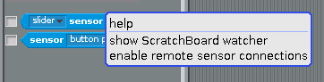

1. Now switch back over to IDLE and press **F5** to run your `rpi.py` script.

1. In Scratch, you should now be able to view the values from the micro:bit's sensors. Simply click on the arrow on the **slider sensor value** block, choose `a` and then check the box:

	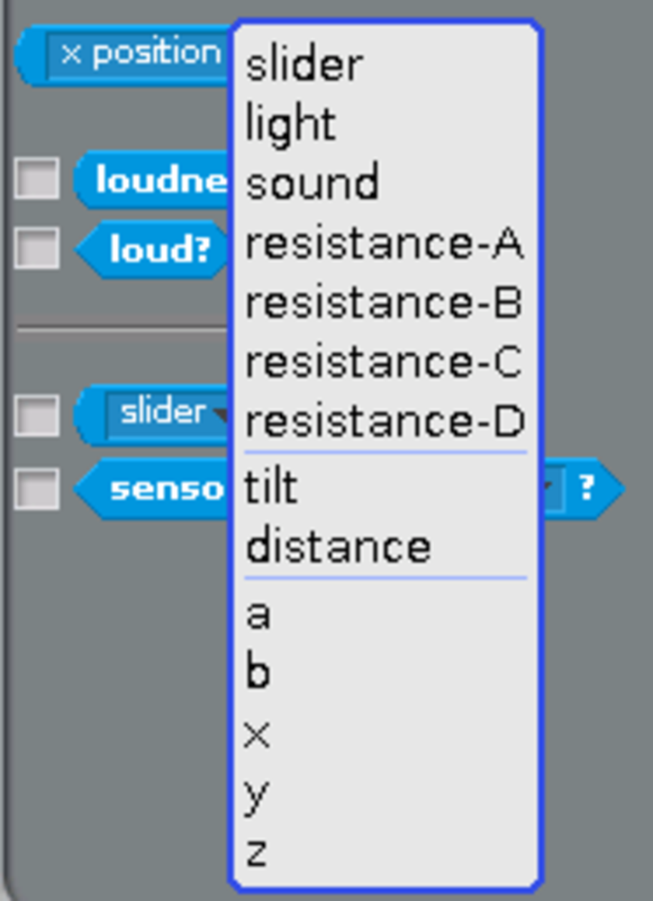
	

1. If you repeat this for sensors `b`, `x`, `y`, and `z`, then your Scratch stage should look something like this:

	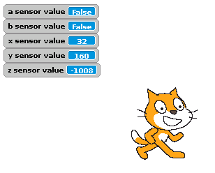

1. If you tilt the micro:bit you should see the `x`, `y`, and `z` values changing. Pushing the buttons will switch `a` and `b` from `False` to `True`.

1. If the readings aren't working, check the micro:bit port again, and make sure the code is running on both the micro:bit and the Raspberry Pi.

## Making the assets

You're going to need three new sprites for this game. Delete the cat sprite and then find a rocket sprite, a UFO sprite and a missile sprite. You can use the ones below if you like, search on the web, or even draw your own.


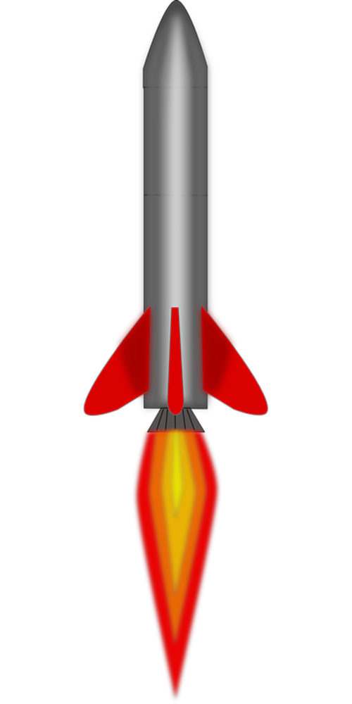

1. Import each of your sprites into Scratch:

	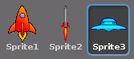

1. Rename the sprites by changing the name in the **scripts** pane:

	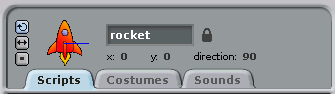

1. The sprites will also need to be resized. You can use the `shrink sprite` tool to do this:

	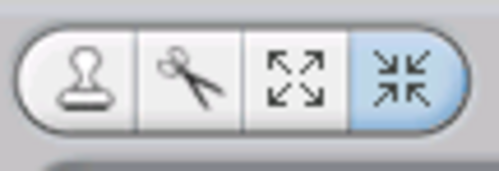

1. Lastly, you should rotate the rocket and missile sprite, so they both point toward the right-hand side of the screen. You can do this by editing the sprite in the **costume** tab and choosing the `rotate` tool:

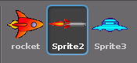


## Coding the rocket

1. To code your game, you can start by adding some scripts to the rocket. Because you want the game to be able to be played over and over again, you should start it by using a `broadcast` block. You'll also need to make a variable called `score` and set it to `0` at the start of the game:

	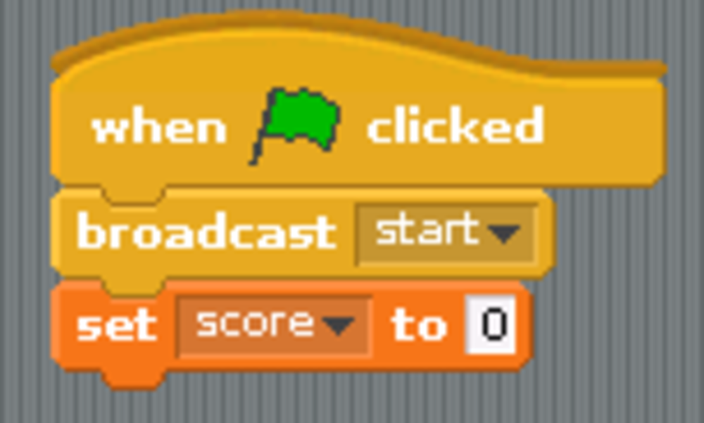

1. To start the game, the rocket needs to be placed in the centre of the screen, pointing towards the right:

	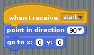

1. Next, you need to control the rotation of the rocket. This is going to be decided by the accelerometer reading from the micro:bit, in particular from the `x` sensor value. At the moment, this is a value between about -1000 and 1000, so it needs to be reduced a little. Create a new variable called `turn` and set it as shown below:

	

1. Test out your game so far: when you tilt the micro:bit left and right, the rocket should spin around. If it's not working, try restarting the Python 3 program on your Raspberry Pi and re-flashing the micro:bit with its program. You might also have to check that the micro:bit hasn't reconnected to a different port; you can check by using the command `ls /dev/ttyA*`.

1. Next, you want the rocket to move. The speed can be determined by how far forwards or backwards the micro:bit has been tilted. You can use the `y` sensor value for this, but as before, you'll need to reduce the value a little (and in this case reverse it).

	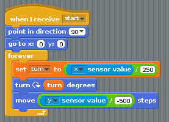

1. Test your flight controls now by tilting the micro:bit left and right, forwards and backwards.

## Coding the UFO

1. The UFO needs to start in a random location and then chase after the rocket. This is fairly easy to set up. The Scratch `stage` stretches from about -250 to 250 horizontally (the x-axis) and -180 to 180 vertically (the y-axis), so picking two random numbers in these ranges will enable you to position the rocket:

	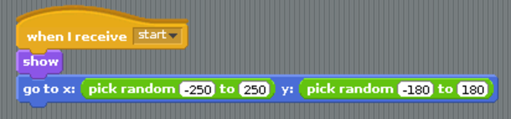

1. Next, you can use a `forever` loop to get the UFO to chase the rocket:

	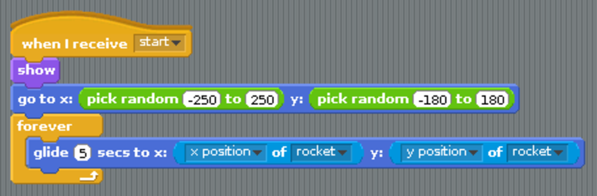

1. In a minute, you'll code the missile to launch at the UFO. If the missile hits the UFO, the game should restart and the player's score should go up by one. A new script is needed for this:

	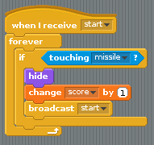

1. To finish off the UFO, the game needs to end if it catches the rocket:

	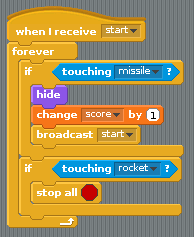

## Coding the missile

1. To make the missile always point in the correct direction, you can make it turn exactly the same way as the rocket:

	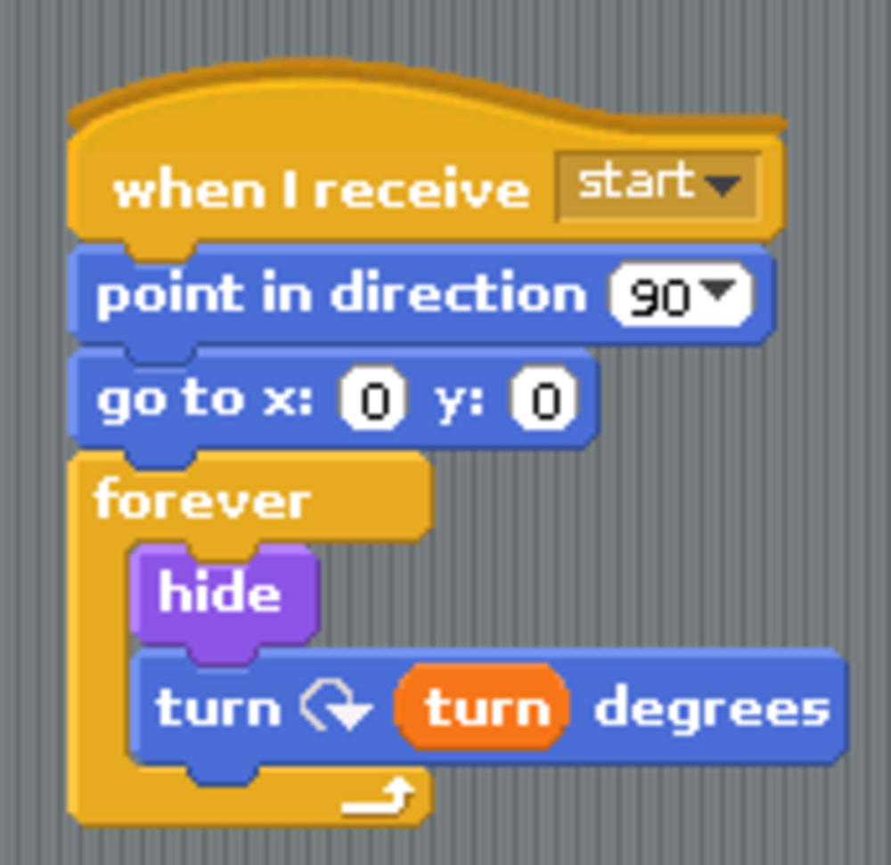

1. Next, whenever the `a` button is pressed on the micro:bit, the missile should fire. To do this, you can move it to the location of the rocket, tell it to `show` and then move forwards until it hits either the UFO or the edge of the screen. It will need to carry on turning as it flies, otherwise the missile's rotation will become out of sync with the rocket.

	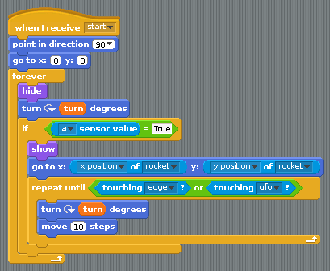

1. Test out your rocket's new ability to shoot missiles.

## What next?

The game has plenty of potential to be improved.

- Can you add in some obstacles for the rocket and UFO to avoid?
- You still have to find a use for the `b` button. Maybe this could start a turbo mode where the rocket flies faster?
- Could the UFO shoot a laser beam at the rocket every now and then?
